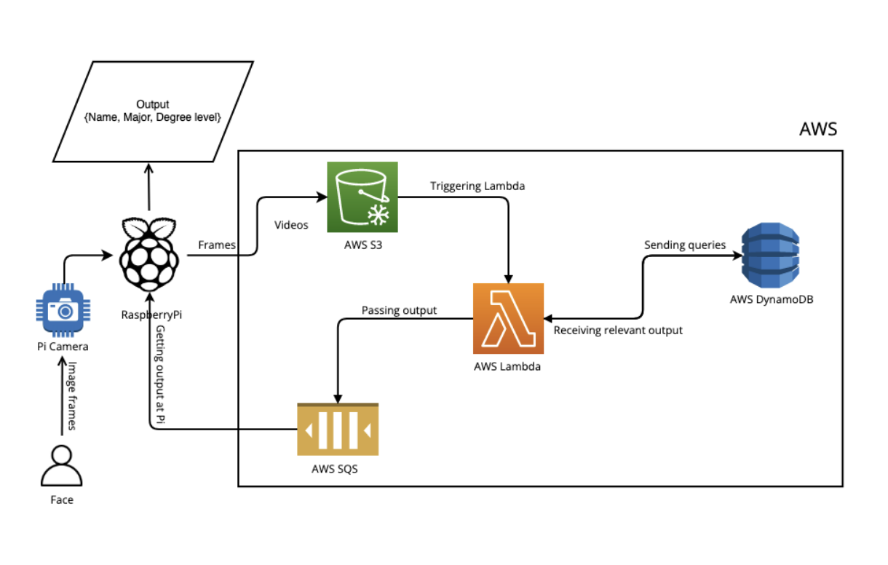

#  Face Recognition on a PAAS

### Description

In this global era of advanced computing, it is critical to delivering a cost-effective and reliable solution to the problem at hand. AWS, Microsoft Azure, and other cloud service providers offer similar capabilities for deploying our service (or software) on virtually endless resources. When using cloud IaaS services, we must construct and manage many instances of scalable resources ourselves. However, with Paas, cloud vendors let us just declare the activities or operations we want to do, and they take care of establishing, managing, and destroying resource instances as needed. While the device is simultaneously taking video, this project conducts real-time facial recognition. We'll utilize an AWS service called Lambda for this project, which auto-scales its instances, and an IoT device called a Raspberry Pi (with a linked camera) for live video recording and frame capturing. It will be able to launch and execute several resources at the same time in order to handle a large number of inputs as quickly as feasible. This autoscaling functionality will allow the application to make use of the cloud's capabilities in order to run efficiently and properly. 

### Setup and execution

* RaspberryPI
	- Install the appropriate OS to a memory card and attach the memory card to the raspberryPi, create a user and enable remote access rights. 
	- Install the Pi camera to the raspberryPi and enable the pi camera options. 
	- Install python and required dependencies to the raspberryPi.
	- Run multithread.py to perform the above-mentioned operation.

* Docker
	- Download the docker file and the above-mentioned files along with the other required files to construct the docker image. 
	- Using dockerfile, create a container image and push it to the AWS ECR. 

* AWS Resources
	- Create S3 buckets, SQS result fetching queue and dynamoDB with having student information. 

* Lambda

	- Create and set up Lambda function on AWS using the container image uploaded to AWS ECR. 
	- Provide appropriate access rights for AWS resources to interact with each other. 

### Workflow

The Dockerfile will be used to construct the container image, which will then be published to the AWS ECR. For the purpose of facial recognition, the lambda function "lambdaproc v1" will use this image.
Once the multithread.py file has been executed on the Pi, the video will be taken using the Pi Camera, and the frames will be extracted and uploaded to the S3 bucket. Videos will be added to the S3 bucket as well. 
The lambda function will be invoked for each input frame after the frames are uploaded to the S3 bucket. The facial recognition function will then be executed on the input frame to identify the individual in the frame.
After the individual has been recognized, the details for that person will be retrieved from DynamoDB and transmitted to the SQS queue.
The multithread.py will fetch the results from the SQS queue in parallel (which also captures the videos from Pi Camera). On the Pi CLI, these findings will be shown. 

#### Contributors

- [Subham Kumar](https://www.linkedin.com/in/subham-gc7784)
- [Kenil Patel](https://www.linkedin.com/in/kenil-patel-0101/)

